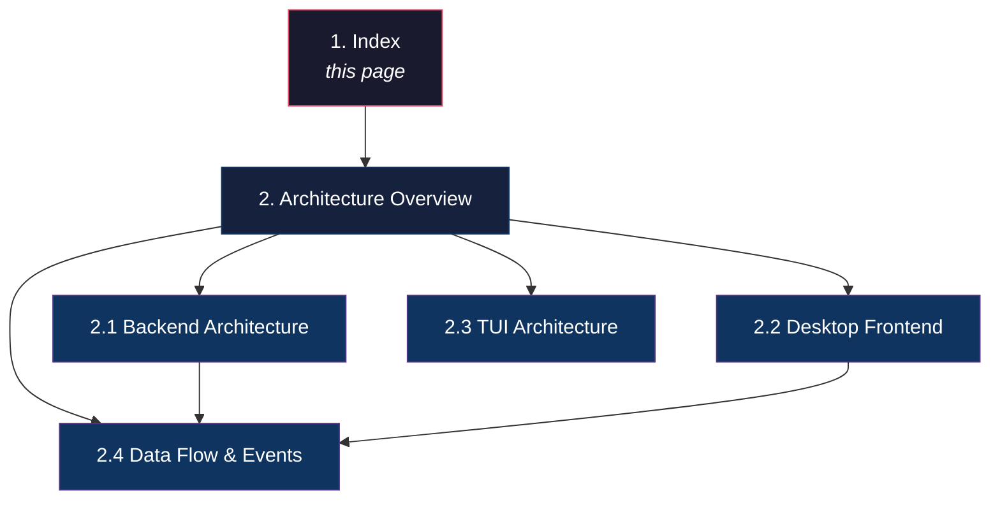

# Orchestra Documentation

> **Source files:** `apps/backend/`, `apps/desktop/`, `apps/tui/`, `packages/`

Orchestra is a multi-agent orchestration platform that dispatches issues to machine learning coding agents, monitors their execution in real time, and surfaces results through a desktop GUI and terminal dashboard. It coordinates multiple agent providers (Claude, Gemini, Codex, OpenCode, Unsandbox) behind a unified Go backend, streaming lifecycle events to connected frontends over SSE.

This documentation covers the system architecture, API surface, backend internals, frontend structure, operational guidance, and reference enums.

---

## Table of Contents

| # | Section | Path | Description |
|---|---------|------|-------------|
| 1 | Overview | [index.md](index.md) | This page -- project introduction and documentation map |
| 2 | Architecture Overview | [architecture/overview.md](architecture/overview.md) | High-level system diagram, component roles, communication patterns |
| 2.1 | Backend Architecture | [architecture/backend.md](architecture/backend.md) | Go backend packages, request lifecycle, dependency graph |
| 2.2 | Desktop Frontend | [architecture/desktop.md](architecture/desktop.md) | Electron + React app, component hierarchy, state management |
| 2.3 | TUI Architecture | [architecture/tui.md](architecture/tui.md) | Bubble Tea terminal dashboard, service manager |
| 2.4 | Data Flow & Events | [architecture/data-flow.md](architecture/data-flow.md) | SSE pipeline, PubSub bus, snapshot polling, retry scheduling |

---

## Documentation Map

---

## Quick Orientation

Orchestra is organized as a monorepo with three applications:

| Application | Language | Location | Purpose |
|-------------|----------|----------|---------|
| **Backend** (`orchestrad`) | Go | `apps/backend/` | REST API, agent dispatch, issue tracking, SSE events |
| **Desktop** | TypeScript / React | `apps/desktop/` | Electron GUI for project management, issue monitoring, git operations |
| **TUI** | Go | `apps/tui/` | Bubble Tea terminal dashboard for starting/stopping services |

Supporting infrastructure lives in `packages/` (shared modules), `ops/` (operational tooling), and `licenses/` (dependency attribution).

### Key Concepts

- **Issue** -- A unit of work dispatched to an agent. Issues move through states: `open` -> `in_progress` -> `done` / `error`.
- **Agent** -- A machine learning coding provider (Claude, Gemini, Codex, OpenCode, Unsandbox) that executes issues.
- **Tracker** -- A pluggable backend for issue storage: in-memory, SQLite, or GitHub Issues.
- **Session** -- A single agent execution run against an issue, with token usage and event history.
- **Snapshot** -- A point-in-time summary of all running and retrying issues, streamed to frontends.
- **Workspace** -- An isolated directory (with its own git branch) where an agent works on an issue.
- **MCP** -- Model Context Protocol, used to connect agents to external tool servers via JSON-RPC over stdio.
- **PubSub** -- The in-process event bus that fans out lifecycle events to all connected SSE subscribers.
