# Orchestra Documentation

> **Source files:** `apps/backend/`, `apps/desktop/`, `apps/tui/`, `packages/`

Orchestra is a multi-agent orchestration platform that dispatches issues to coding agents, monitors their execution in real time, and surfaces results through an Electron desktop app and terminal dashboard. It coordinates multiple agent providers (Claude, Gemini, Codex, OpenCode, Unsandbox) behind a unified Go backend, streaming lifecycle events to connected frontends over SSE.

This documentation covers the system architecture, API surface, backend internals, frontend structure, operational guidance, and reference enums.

---

## Table of Contents

| # | Section | Path | Description |
|---|---------|------|-------------|
| | Orchestra Documentation | [index.md](index.md) | This page — project introduction and documentation map |
| **1** | **Architecture** | | |
| 1.1 | Overview | [architecture/overview.md](architecture/overview.md) | High-level system diagram, component roles, communication patterns |
| 1.2 | Backend Architecture | [architecture/backend.md](architecture/backend.md) | Go backend packages, request lifecycle, dependency graph |
| 1.3 | Desktop Frontend | [architecture/desktop.md](architecture/desktop.md) | Electron + React app, component hierarchy, state management |
| 1.4 | TUI Architecture | [architecture/tui.md](architecture/tui.md) | Bubble Tea terminal dashboard, service manager |
| 1.5 | Data Flow & Events | [architecture/data-flow.md](architecture/data-flow.md) | SSE pipeline, PubSub bus, snapshot polling, retry scheduling |
| 1.6 | Embedded Agent | [architecture/embedded-agent.md](architecture/embedded-agent.md) | ML co-pilot widget: module structure, data flow, provider config, tool system |
| **2** | **API** | | |
| 2.1 | API Reference | [api/reference.md](api/reference.md) | REST endpoint catalog, request/response formats |
| 2.2 | JSON Schemas & Types | [api/schemas.md](api/schemas.md) | Shared data structures and payload types |
| 2.3 | SSE Events | [api/sse-events.md](api/sse-events.md) | Server-sent event stream protocol and event types |
| 2.4 | Agent Providers | [api/agent-providers.md](api/agent-providers.md) | LLM API key storage endpoints for embedded agent |
| **3** | **Backend** | | |
| 3.1 | Orchestrator | [backend/orchestrator.md](backend/orchestrator.md) | Core dispatch loop, state machine, retry logic |
| 3.2 | Agents | [backend/agents.md](backend/agents.md) | Agent providers, runner pool, command execution |
| 3.3 | Tracker | [backend/tracker.md](backend/tracker.md) | Issue storage backends (in-memory, SQLite, GitHub) |
| 3.4 | Workspace | [backend/workspace.md](backend/workspace.md) | Isolated git workspaces for agent execution |
| 3.5 | Database | [backend/database.md](backend/database.md) | SQLite schema, migrations, query patterns |
| 3.6 | Configuration | [backend/config.md](backend/config.md) | Runtime configuration and environment variables |
| 3.7 | MCP | [backend/mcp.md](backend/mcp.md) | Model Context Protocol server integration |
| 3.8 | Tools | [backend/tools.md](backend/tools.md) | Tool system and registration |
| 3.9 | Telemetry | [backend/telemetry.md](backend/telemetry.md) | Logging, metrics, and observability |
| **4** | **Frontend** | | |
| 4.1 | Components | [frontend/components.md](frontend/components.md) | React component library and hierarchy |
| 4.2 | Views | [frontend/views.md](frontend/views.md) | Page-level view components and routing |
| 4.3 | API Client | [frontend/client.md](frontend/client.md) | TypeScript HTTP client and request helpers |
| 4.4 | State Management | [frontend/state-management.md](frontend/state-management.md) | Runtime sync, snapshot store, event timeline |
| 4.5 | Electron | [frontend/electron.md](frontend/electron.md) | Main process, preload, IPC bridge |
| 4.6 | Embedded Agent Components | [frontend/embedded-agent-components.md](frontend/embedded-agent-components.md) | Widget, panel, chat, tool feedback, json-render, settings components |
| **5** | **Guides** | | |
| 5.1 | Getting Started | [guides/getting-started.md](guides/getting-started.md) | Setup, prerequisites, first run |
| 5.2 | Configuration | [guides/configuration.md](guides/configuration.md) | Environment variables and config files |
| 5.3 | Development | [guides/development.md](guides/development.md) | Local dev workflow, testing, contributing |
| 5.4 | Embedded Agent Setup | [guides/embedded-agent-setup.md](guides/embedded-agent-setup.md) | Provider config, model selection, chat usage, troubleshooting |
| **6** | **Operations** | | |
| 6.1 | Deployment | [operations/deployment.md](operations/deployment.md) | Production deployment patterns |
| 6.2 | Docker | [operations/docker.md](operations/docker.md) | Container builds and compose setup |
| 6.3 | CI/CD | [operations/ci-cd.md](operations/ci-cd.md) | GitHub Actions workflows and automation |
| **7** | Enums & Constants | [enums.md](enums.md) | Shared enum values and constant definitions |

---

## Documentation Map

```mermaid
graph TD
    INDEX["Orchestra Documentation"]

    INDEX --> ARCH["1. Architecture"]
    INDEX --> API["2. API"]
    INDEX --> BACK["3. Backend"]
    INDEX --> FRONT["4. Frontend"]
    INDEX --> GUIDES["5. Guides"]
    INDEX --> OPS["6. Operations"]
    INDEX --> ENUMS["7. Enums"]

    ARCH --> A1["1.1 Overview"]
    ARCH --> A2["1.2 Backend"]
    ARCH --> A3["1.3 Desktop"]
    ARCH --> A4["1.4 TUI"]
    ARCH --> A5["1.5 Data Flow"]
    ARCH --> A6["1.6 Embedded Agent"]

    API --> B1["2.1 Reference"]
    API --> B2["2.2 Schemas"]
    API --> B3["2.3 SSE Events"]
    API --> B4["2.4 Agent Providers"]

    BACK --> C1["3.1 Orchestrator"]
    BACK --> C2["3.2 Agents"]
    BACK --> C3["3.3 Tracker"]

    FRONT --> D1["4.1 Components"]
    FRONT --> D2["4.2 Views"]
    FRONT --> D3["4.3 Client"]
```

---

## Quick Orientation

Orchestra is organized as a monorepo with three applications:

| Application | Language | Location | Purpose |
|-------------|----------|----------|---------|
| **Backend** (`orchestrad`) | Go | `apps/backend/` | REST API, agent dispatch, issue tracking, SSE events |
| **Desktop** | TypeScript / React | `apps/desktop/` | Electron GUI for tasks, projects, analytics, terminals, docs, and embedded-agent workflows |
| **TUI** | Go | `apps/tui/` | Bubble Tea process manager for backend/frontend dev services |

Supporting infrastructure lives in `packages/` (shared modules), `ops/` (operational tooling), and `licenses/` (dependency attribution).

### Key Concepts

- **Issue** -- A unit of work dispatched to an agent. Common states in the current workflow include `Backlog`, `Todo`, `In Progress`, `Review`, and `Done`.
- **Agent** -- A machine learning coding provider (Claude, Gemini, Codex, OpenCode, Unsandbox) that executes issues.
- **Tracker** -- A pluggable backend for issue storage. In normal local runtime the backend uses SQLite, with GitHub integration available when configured.
- **Session** -- A single agent execution run against an issue, with token usage and event history.
- **Snapshot** -- A point-in-time summary of all running and retrying issues, streamed to frontends.
- **Workspace** -- An isolated directory (with its own git branch) where an agent works on an issue.
- **MCP** -- Model Context Protocol, used to connect agents to external tool servers via JSON-RPC over stdio.
- **PubSub** -- The in-process event bus that fans out lifecycle events to all connected SSE subscribers.
