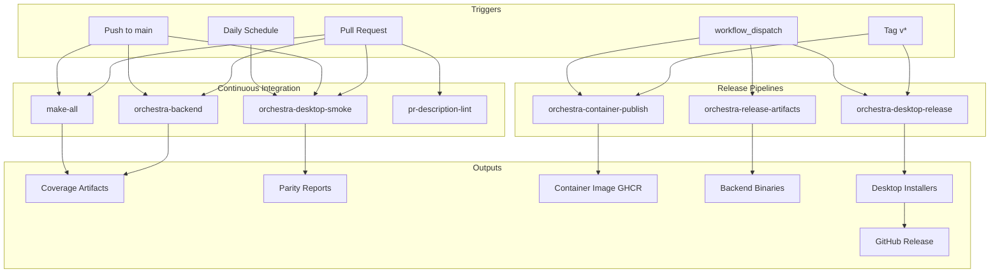

# 6.1 CI/CD Pipelines

> **Source files:** `.github/workflows/*.yml`, `.github/actions/`

Orchestra uses GitHub Actions for continuous integration, testing, and release automation. All workflows use pinned action SHAs, concurrency groups to avoid duplicate runs, and reusable composite actions for Go and Node.js setup.

## 6.1.1 Workflow Overview

## 6.1.2 Workflow Reference Table

| Workflow | File | Trigger | Purpose | Key Steps |
|----------|------|---------|---------|-----------|
| **orchestra-backend** | `orchestra-backend.yml` | PR/push on `apps/backend/**` | Backend CI: lint, vet, test, race detection | `gofmt` check, `go vet`, `go test -coverprofile`, `go test -race`, naming guard script |
| **orchestra-desktop-smoke** | `orchestra-desktop-smoke.yml` | PR/push on `apps/desktop/**` or `apps/backend/**`, daily cron (07:00 UTC), manual | Desktop release gate validation | `npm ci`, `npm run release:gate` (parity + readiness), upload parity report |
| **make-all** | `make-all.yml` | PR/push on `apps/tui/**` or `Makefile` | TUI build and test | `go test -coverprofile`, `make build` |
| **pr-description-lint** | `pr-description-lint.yml` | PR opened/edited/reopened/synchronize/ready_for_review | Validate PR description format | Write PR body to file, `go run ./apps/backend/cmd/orchestra check-pr-body` |
| **orchestra-container-publish** | `orchestra-container-publish.yml` | Tag `v*`, manual | Build and push backend container to GHCR | Docker login, metadata extraction (semver + SHA tags), `docker build-push` using `ops/docker/Dockerfile.backend` |
| **orchestra-desktop-release** | `orchestra-desktop-release.yml` | Tag `v*`, manual (with title + notes inputs) | Build desktop installers for all platforms and publish GitHub Release | Validate release notes (require `## Summary` and `## Validation`), build backend sidecar per OS, `npm run dist:desktop`, upload artifacts, `gh release create` |
| **orchestra-release-artifacts** | `orchestra-release-artifacts.yml` | Manual only | Build backend binaries as downloadable artifacts | `go build` for `orchestrad` and `orchestra`, upload artifact |

## 6.1.3 CI Jobs Detail

### orchestra-backend

Runs three parallel jobs:

1. **backend-tests** -- Formatting check (`gofmt -l`), `go vet ./...`, `go test -coverprofile=coverage.out ./...`. Uploads coverage artifact.
2. **backend-race-tests** -- `go test -race ./...` to detect data races.
3. **naming-guard** -- Runs `.github/scripts/check-orchestra-naming.sh` to enforce naming conventions.

### orchestra-desktop-smoke

Single job that runs the full desktop release gate:

- Installs Node and Go dependencies
- Runs `npm run release:gate` which executes parity verification (twice) and release readiness checks
- Always uploads the parity report artifact, even on failure

### make-all

Single job for TUI validation:

- Runs `go test -coverprofile=coverage.out ./...` in `apps/tui/`
- Verifies `make build` completes successfully

## 6.1.4 Release Pipelines Detail

### Container Publish

Publishes to `ghcr.io/<owner>/orchestra-backend` with three tag strategies:

| Tag Pattern | Example | Description |
|-------------|---------|-------------|
| `{{version}}` | `1.2.3` | Full semver |
| `{{major}}.{{minor}}` | `1.2` | Minor release track |
| `sha-<hash>` | `sha-abc1234` | Git commit SHA |

### Desktop Release

Multi-platform build matrix (`ubuntu-latest`, `windows-latest`, `macos-latest`):

1. **Validate release message** -- Requires `## Summary` and `## Validation` sections in release notes.
2. **Package desktop** -- Builds the Go backend sidecar for each OS, then runs `npm run dist:desktop` via electron-builder.
3. **Publish release** -- Downloads all platform artifacts and uploads them to a GitHub Release via `gh release create`.

Output formats per platform:

| Platform | Formats |
|----------|---------|
| Linux | AppImage, deb |
| macOS | dmg, zip |
| Windows | nsis (x64) |

## 6.1.5 Reusable Actions

All workflows reference composite actions from `.github/actions/`:

- **setup-go-cached** -- Sets up Go with module caching, parameterized by `go-mod-path` and `go-sum-path`.
- **setup-node-cached** -- Sets up Node.js with npm caching, parameterized by `cache-dependency-path`.

## 6.1.6 Common Configuration

All workflows share these settings:

- **Concurrency:** `group: ${{ github.workflow }}-${{ github.ref }}` with `cancel-in-progress: true` to avoid redundant runs.
- **Permissions:** Least-privilege (`contents: read` for CI, `contents: write` + `packages: write` only where needed).
- **Node compatibility:** `FORCE_JAVASCRIPT_ACTIONS_TO_NODE24: true` environment variable set globally.

---

*Cross-references: [Container Build](docker.md) (Section 6.2), [Deployment](deployment.md) (Section 6)*
