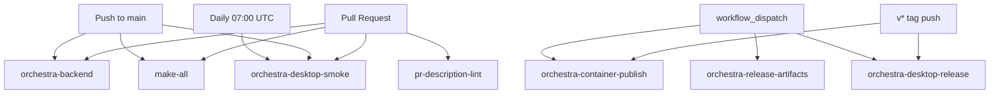
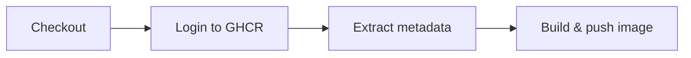
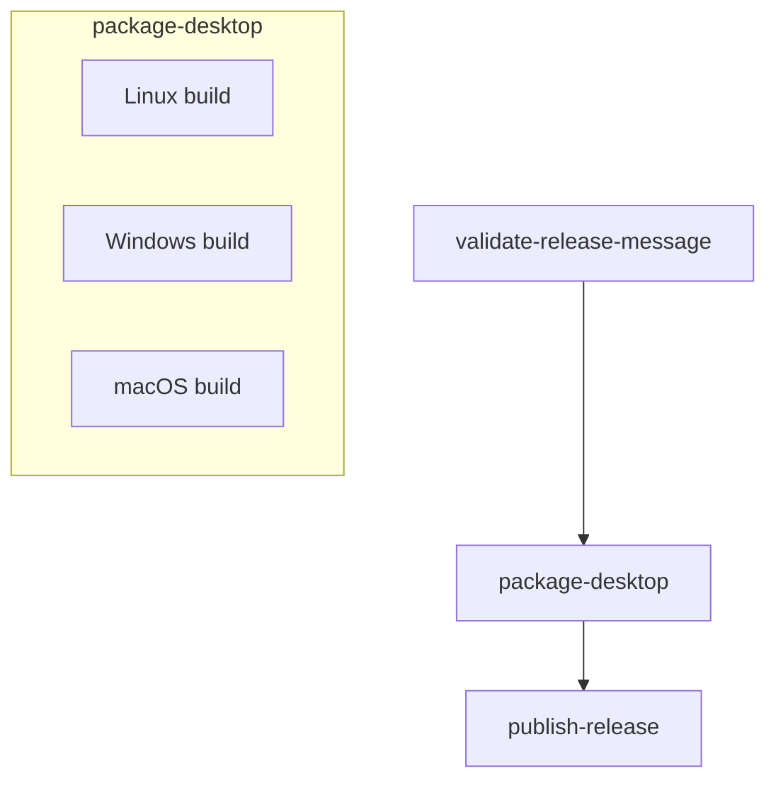

# 6.1 CI/CD Pipelines

> **Source files:**
> [`.github/workflows/orchestra-backend.yml`](../../.github/workflows/orchestra-backend.yml) |
> [`.github/workflows/orchestra-container-publish.yml`](../../.github/workflows/orchestra-container-publish.yml) |
> [`.github/workflows/orchestra-desktop-release.yml`](../../.github/workflows/orchestra-desktop-release.yml) |
> [`.github/workflows/orchestra-desktop-smoke.yml`](../../.github/workflows/orchestra-desktop-smoke.yml) |
> [`.github/workflows/orchestra-release-artifacts.yml`](../../.github/workflows/orchestra-release-artifacts.yml) |
> [`.github/workflows/pr-description-lint.yml`](../../.github/workflows/pr-description-lint.yml) |
> [`.github/workflows/make-all.yml`](../../.github/workflows/make-all.yml) |
> [`.github/actions/setup-go-cached/action.yml`](../../.github/actions/setup-go-cached/action.yml) |
> [`.github/actions/setup-node-cached/action.yml`](../../.github/actions/setup-node-cached/action.yml) |
> [`.github/scripts/check-orchestra-naming.sh`](../../.github/scripts/check-orchestra-naming.sh)

All CI/CD for Orchestra runs on GitHub Actions. Workflows are organized by concern: backend quality gates, desktop smoke tests and releases, container publishing, and repository hygiene. Every workflow uses concurrency groups with `cancel-in-progress: true` to avoid redundant runs.

---

## Workflow Overview



---

## Workflows

### orchestra-backend

**Trigger:** PR or push to `main` when `apps/backend/**` changes.

Runs three parallel jobs:

| Job | Purpose | Key command |
|-----|---------|-------------|
| `backend-tests` | Format check, `go vet`, unit/integration tests with coverage | `go test -coverprofile=coverage.out ./...` |
| `backend-race-tests` | Data-race detection | `go test -race ./...` |
| `naming-guard` | Prevents reintroduction of legacy "Symphony" symbols | `.github/scripts/check-orchestra-naming.sh` |

**Artifacts:** `backend-coverage` (coverage.out).

---

### orchestra-desktop-smoke

**Trigger:** PR or push to `main` when `apps/desktop/**` or `apps/backend/**` changes, daily cron at 07:00 UTC, or manual dispatch.

| Step | Description |
|------|-------------|
| Setup Node + Go | Via reusable composite actions |
| `npm ci` | Install desktop dependencies |
| `npm run release:gate` | Run the desktop release gate checks |

**Artifacts:** `orchestra-desktop-parity-report` (always uploaded, even on failure).

---

### orchestra-container-publish

**Trigger:** `v*` tag push or manual dispatch.

**Permissions:** `contents: read`, `packages: write`.



| Detail | Value |
|--------|-------|
| Registry | `ghcr.io` |
| Image name | `<owner>/orchestra-backend` |
| Tag strategy | `semver {{version}}`, `semver {{major}}.{{minor}}`, `sha` |
| Dockerfile | `ops/docker/Dockerfile.backend` |

Uses `docker/metadata-action` to derive OCI labels and `docker/build-push-action` to build and push in a single step.

---

### orchestra-desktop-release

**Trigger:** `v*` tag push or manual dispatch (requires `release_title` and `release_notes` inputs).

**Permissions:** `contents: write` (creates GitHub Releases).



**Jobs:**

| Job | Details |
|-----|---------|
| `validate-release-message` | Ensures release notes contain `## Summary` and `## Validation` sections. For tag pushes, reads the annotated tag message; for manual dispatch, uses workflow inputs. |
| `package-desktop` | Matrix build across `ubuntu-latest`, `windows-latest`, `macos-latest`. Builds the Go backend sidecar for each platform, then runs `npm run dist:desktop` to produce installers. |
| `publish-release` | Downloads all platform artifacts and uploads them to the GitHub Release via `gh release create` / `gh release upload --clobber`. Only runs on tag pushes. |

**Artifacts:** `orchestra-desktop-Linux`, `orchestra-desktop-Windows`, `orchestra-desktop-macOS`.

---

### orchestra-release-artifacts

**Trigger:** Manual dispatch only.

Builds the backend Go binaries (`orchestrad` and `orchestra`) and uploads them as `orchestra-backend-artifacts`. Useful for producing build artifacts without a full release.

---

### pr-description-lint

**Trigger:** Pull request opened, edited, reopened, synchronized, or marked ready for review.

Validates the PR body format by writing it to a temp file and running:

```bash
go run ./apps/backend/cmd/orchestra check-pr-body /tmp/pr_body.md
```

Enforces a consistent PR description structure across the repository.

---

### make-all

**Trigger:** PR or push to `main` when `apps/tui/**` or `Makefile` changes.

| Step | Command |
|------|---------|
| TUI tests | `cd apps/tui && go test -coverprofile=coverage.out ./...` |
| Build verification | `make build` |

**Artifacts:** `tui-coverage` (coverage.out).

---

## Reusable Composite Actions

Both actions live under `.github/actions/` and are referenced with `uses: ./.github/actions/<name>`.

### setup-go-cached

Installs Go (version derived from `go.mod`) with module cache keyed on `go.sum`.

| Input | Required | Description |
|-------|----------|-------------|
| `go-mod-path` | Yes | Path to `go.mod` |
| `go-sum-path` | Yes | Path to `go.sum` |

### setup-node-cached

Installs Node.js with npm cache keyed on `package-lock.json`.

| Input | Required | Default | Description |
|-------|----------|---------|-------------|
| `node-version` | No | `20` | Node.js major version |
| `cache-dependency-path` | Yes | -- | Path to `package-lock.json` |

---

## Naming Guard Script

`.github/scripts/check-orchestra-naming.sh` uses `rg` (ripgrep) to scan `apps/backend` and `packages/protocol` for any occurrence of the legacy name "Symphony" (case-insensitive). Test files and docs directories are excluded. The script exits non-zero if forbidden symbols are found, enforcing a clean namespace.

---

## Common Patterns

All workflows share these conventions:

- **Pinned actions:** Every third-party action is pinned to a full commit SHA with a version comment.
- **`FORCE_JAVASCRIPT_ACTIONS_TO_NODE24: true`:** Set as a global env to ensure JavaScript-based actions run on Node 24.
- **Concurrency groups:** `${{ github.workflow }}-${{ github.ref }}` with `cancel-in-progress: true`.
- **`contents: read` by default:** Least-privilege permissions; only the desktop release workflow requests `contents: write`.

---

## Cross-References

- [6. Deployment & Operations](deployment.md) -- high-level deployment options and environment variables.
- [6.2 Container Build](docker.md) -- Dockerfile stages and runtime configuration.
