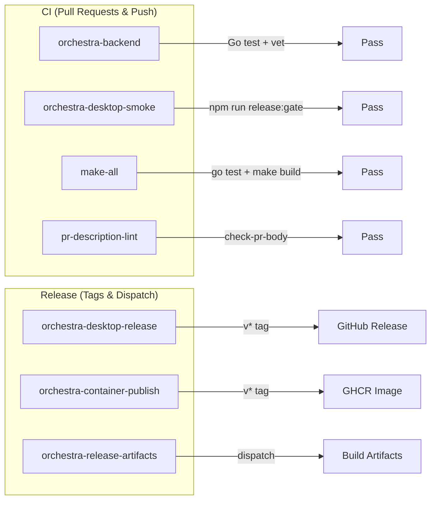
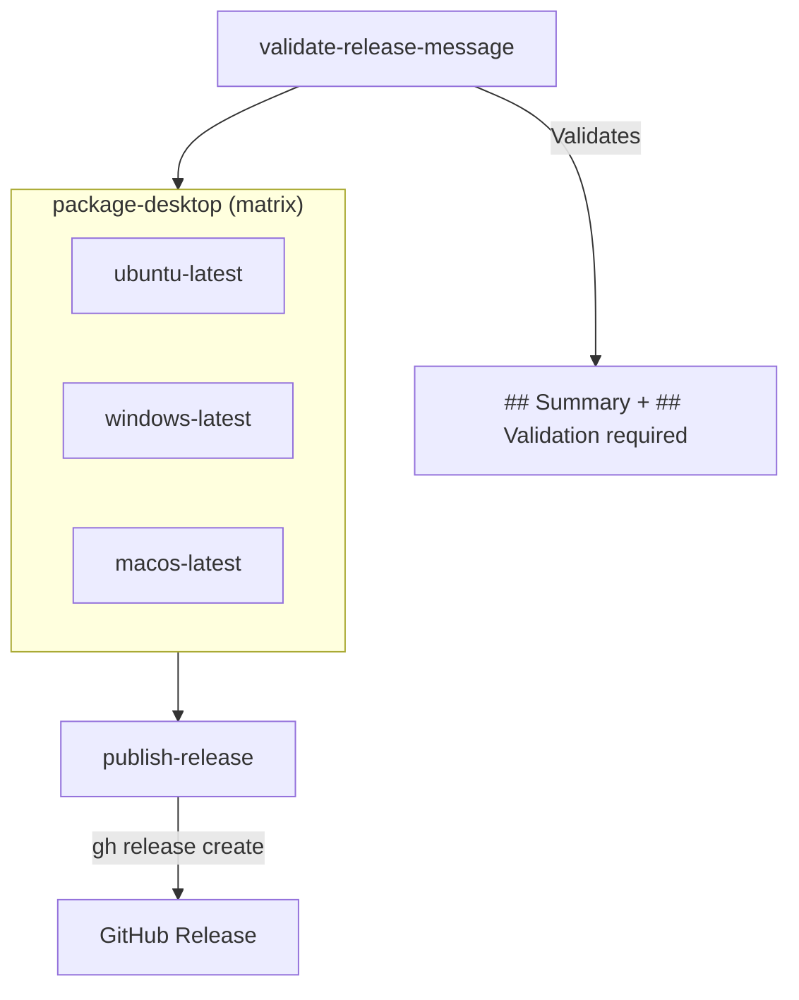

# 6.1 CI/CD Pipelines

> **Source files:**
> - `.github/workflows/orchestra-backend.yml` -- Backend Go tests, vet, formatting
> - `.github/workflows/orchestra-desktop-smoke.yml` -- Frontend tests and build validation
> - `.github/workflows/make-all.yml` -- TUI tests and Makefile build
> - `.github/workflows/orchestra-desktop-release.yml` -- Cross-platform desktop packaging and GitHub release
> - `.github/workflows/orchestra-container-publish.yml` -- Docker image build and GHCR publish
> - `.github/workflows/orchestra-release-artifacts.yml` -- Backend binary artifact builds
> - `.github/workflows/pr-description-lint.yml` -- PR description format validation
> - `.github/actions/setup-go-cached/action.yml` -- Composite action for Go setup
> - `.github/actions/setup-node-cached/action.yml` -- Composite action for Node.js setup

Orchestra uses GitHub Actions for continuous integration and release automation. All workflows use pinned action versions (commit SHA) and apply concurrency controls to cancel in-progress runs on the same branch.

---

### Pipeline Overview



---

### CI Workflows

#### orchestra-backend.yml

**Triggers:** Pull requests and pushes to `main` affecting `apps/backend/**`

| Job | Steps | Purpose |
|-----|-------|---------|
| `backend-tests` | `gofmt -l`, `go vet`, `go test -coverprofile` | Format verification, static analysis, unit/integration tests with coverage |
| `backend-race-tests` | `go test -race` | Data race detection under the Go race detector |
| `naming-guard` | `.github/scripts/check-orchestra-naming.sh` | Ensures Orchestra naming conventions are followed |

Coverage reports are uploaded as artifacts.

#### orchestra-desktop-smoke.yml

**Triggers:** Pull requests and pushes affecting `apps/desktop/**` or `apps/backend/**`, daily schedule (7:00 UTC), manual dispatch

| Job | Steps | Purpose |
|-----|-------|---------|
| `desktop-smoke` | `npm ci`, `npm run release:gate` | Installs deps, runs parity verification twice, then release readiness checks |

The `release:gate` script chains:
1. `parity:verify` (x2) -- Validates frontend/backend API parity
2. `release:readiness` -- Checks build health and completeness

Parity reports are uploaded as artifacts.

#### make-all.yml

**Triggers:** Pull requests and pushes affecting `apps/tui/**` or `Makefile`

| Job | Steps | Purpose |
|-----|-------|---------|
| `make-all` | `go test -coverprofile`, `make build` | TUI unit tests with coverage, Makefile build verification |

#### pr-description-lint.yml

**Triggers:** Pull request opened, edited, reopened, synchronized, or marked ready for review

| Job | Steps | Purpose |
|-----|-------|---------|
| `validate-pr-description` | Write PR body to file, `go run ./apps/backend/cmd/orchestra check-pr-body` | Validates PR description format using the Orchestra CLI's built-in checker |

---

### Release Workflows

#### orchestra-desktop-release.yml

**Triggers:** Push of `v*` tags, manual dispatch with release title and notes



**Release validation requirements:**
- Release title must not be empty
- Release notes must contain `## Summary` and `## Validation` sections
- For tag pushes, notes are extracted from the annotated tag message
- For manual dispatch, notes are provided via the workflow input

**Cross-platform build matrix:**

| OS | Backend Sidecar Path | Desktop Output |
|----|---------------------|----------------|
| Linux (x64) | `resources/backend/linux-x64/orchestrad` | AppImage, deb |
| Windows (x64) | `resources/backend/win32-x64/orchestrad.exe` | NSIS installer |
| macOS | `resources/backend/darwin-<arch>/orchestrad` | DMG, zip |

Each platform job:
1. Sets up Node.js and Go
2. Installs desktop dependencies
3. Builds the `orchestrad` sidecar for the target platform
4. Runs `npm run dist:desktop` (electron-builder)
5. Uploads packaged artifacts

The `publish-release` job downloads all platform artifacts and uploads them to a GitHub release.

#### orchestra-container-publish.yml

**Triggers:** Push of `v*` tags, manual dispatch

| Step | Action | Purpose |
|------|--------|---------|
| Login | `docker/login-action` | Authenticate to GHCR |
| Metadata | `docker/metadata-action` | Generate semver + SHA tags |
| Build & Push | `docker/build-push-action` | Multi-stage build from `ops/docker/Dockerfile.backend` |

**Image tags generated:**
- `<version>` (e.g., `1.2.3`)
- `<major>.<minor>` (e.g., `1.2`)
- `sha-<commit>` (e.g., `sha-abc1234`)

**Registry:** `ghcr.io/<owner>/orchestra-backend`

#### orchestra-release-artifacts.yml

**Triggers:** Manual dispatch only

Builds `orchestrad` and `orchestra` binaries for Linux (amd64) and uploads them as workflow artifacts. Used for ad-hoc artifact builds outside the release cycle.

---

### Composite Actions

Two reusable composite actions standardize toolchain setup:

#### setup-go-cached

**Location:** `.github/actions/setup-go-cached/action.yml`

| Input | Required | Description |
|-------|----------|-------------|
| `go-mod-path` | Yes | Path to `go.mod` for version detection |
| `go-sum-path` | Yes | Path to `go.sum` for cache key |

Uses `actions/setup-go` with automatic Go version detection from `go.mod` and module cache keyed on `go.sum`.

#### setup-node-cached

**Location:** `.github/actions/setup-node-cached/action.yml`

| Input | Required | Default | Description |
|-------|----------|---------|-------------|
| `node-version` | No | `20` | Node.js version |
| `cache-dependency-path` | Yes | -- | Path to `package-lock.json` for cache key |

Uses `actions/setup-node` with npm caching.

---

### Concurrency Controls

All workflows use concurrency groups to cancel in-progress runs:

```yaml
concurrency:
  group: ${{ github.workflow }}-${{ github.ref }}
  cancel-in-progress: true
```

This prevents resource waste when multiple commits are pushed in quick succession.

---

### Environment Variables

All workflows set `FORCE_JAVASCRIPT_ACTIONS_TO_NODE24: true` for Node.js action compatibility.

The backend workflows set `GOWORK: 'off'` to disable Go workspace mode, ensuring isolated module resolution.
