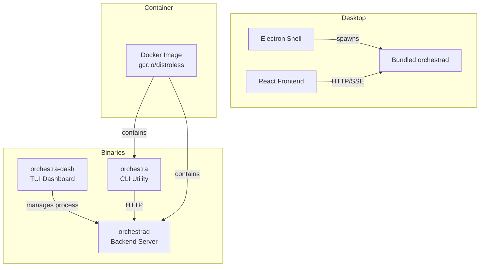
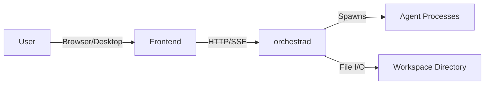
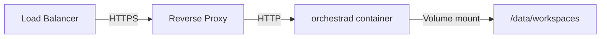

# 6.1 Deployment & Operations

> **Source files:**
> - `apps/backend/cmd/orchestrad/` -- Backend server entry point
> - `apps/backend/cmd/orchestra/` -- CLI utility
> - `apps/desktop/package.json` -- Desktop build scripts
> - `apps/desktop/electron/main.cjs` -- Electron managed backend lifecycle
> - `ops/docker/Dockerfile.backend` -- Container build
> - `Makefile` -- TUI build targets

Orchestra is deployed as a set of cooperating binaries: the `orchestrad` backend server, the `orchestra` CLI, an optional Electron desktop application, and an optional TUI dashboard. This document covers how to build and run each component from the current repository.

---

### Component Overview



---

### Backend Binary Build

The backend is written in Go. Build from the `apps/backend/` directory:

```bash
cd apps/backend
go build -o orchestrad ./cmd/orchestrad
go build -o orchestra ./cmd/orchestra
```

Both binaries are statically linkable. For production Linux deployments:

```bash
CGO_ENABLED=0 GOOS=linux GOARCH=amd64 go build -o orchestrad ./cmd/orchestrad
```

#### Running the Backend

```bash
export ORCHESTRA_SERVER_HOST=127.0.0.1
export ORCHESTRA_SERVER_PORT=4010
export ORCHESTRA_API_TOKEN=your-secret-token
export ORCHESTRA_WORKSPACE_ROOT=~/.orchestra/workspaces

./orchestrad
```

The server exposes a REST API on the configured host and port. See the [Configuration Guide](../guides/configuration.md) for all environment variables.

---

### Desktop Application Packaging

The desktop application bundles the React frontend and an `orchestrad` sidecar binary into a native Electron application.

#### Build Steps

```bash
cd apps/desktop

# 1. Install dependencies
npm ci

# 2. Build frontend + stage backend binary
npm run dist:prep

# 3. Package for distribution
npm run dist:desktop
```

The `dist:prep` step:
1. Runs `vite build` to compile the React frontend
2. Executes `scripts/stage-backend-binary.mjs` to copy the correct platform `orchestrad` binary into `resources/backend/<platform>-<arch>/`

`stage-backend-binary.mjs` resolves the backend binary from:

- `ORCHESTRA_BACKEND_BIN` if explicitly provided
- `apps/desktop/resources/backend/<platform>-<arch>/`
- `apps/backend/orchestrad`
- `apps/backend/dist/orchestra/orchestrad`

#### Platform Targets

| Platform | Output Format | Output Path |
|----------|--------------|-------------|
| macOS | `.dmg`, `.zip` | `release/` |
| Windows | `.exe` (NSIS installer) | `release/` |
| Linux | `.AppImage`, `.deb` | `release/` |

#### Backend Sidecar

When the desktop app launches in production mode, it automatically:
1. Locates the bundled `orchestrad` binary in the app resources
2. Finds an available port (starting from 4010)
3. Generates a random API token
4. Spawns `orchestrad` as a child process
5. Waits for it to become healthy (up to 20 seconds)
6. Configures the frontend to connect to `http://127.0.0.1:<port>`

---

### TUI Dashboard

The terminal UI dashboard provides a lightweight monitoring interface:

```bash
# Run directly
cd apps/tui && go run .

# Build binary
make build    # outputs to ./orchestra-dash

# Install system-wide
make install  # installs to /usr/local/bin/orchestra-dash
```

The TUI manages backend and frontend dev processes, but it does not auto-start them on launch; start/stop is driven from the UI with the `s` key.

---

### Docker Container

See [6.2 Docker Container Build](docker.md) for full details.

```bash
docker build -f ops/docker/Dockerfile.backend -t orchestra-backend .
docker run -p 4010:4010 orchestra-backend
```

---

### Production Configuration

#### Required Environment Variables

| Variable | Description |
|----------|-------------|
| `ORCHESTRA_SERVER_HOST` | Bind address (use `0.0.0.0` for container/remote access) |
| `ORCHESTRA_SERVER_PORT` | Listen port (default: `4010`) |
| `ORCHESTRA_API_TOKEN` | **Required** for non-loopback hosts |
| `ORCHESTRA_WORKSPACE_ROOT` | Directory for agent workspaces |

#### Security Considerations

- **API Token**: Required when binding to non-loopback addresses. The backend enforces this at startup.
- **Token encryption**: Set `ORCHESTRA_TOKEN_KEY` to enable AES-based encryption for stored tokens handled by the backend database layer.
- **TLS**: Terminate TLS at a reverse proxy (nginx, Caddy) in front of `orchestrad`.

#### Health Check

The backend exposes HTTP health endpoints at `/healthz` and `/api/v1/healthz`. The CLI also exposes a check command:

```bash
/usr/local/bin/orchestra check
```

---

### Deployment Architectures

#### Standalone (Single Machine)



#### Containerized



Mount a persistent volume at the workspace root to preserve agent workspaces across container restarts.
