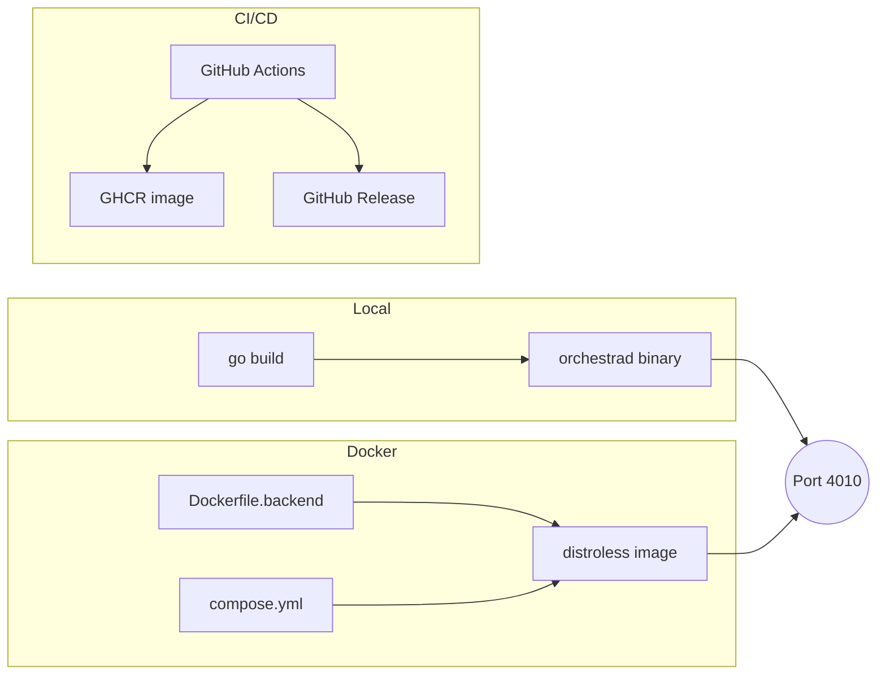

# 6. Deployment & Operations

> **Source files:**
> [`ops/docker/Dockerfile.backend`](../../ops/docker/Dockerfile.backend) |
> [`ops/docker/compose.yml`](../../ops/docker/compose.yml) |
> [`.github/workflows/`](../../.github/workflows/)

Orchestra supports three deployment modes: local development builds, Docker containers, and automated CI/CD through GitHub Actions. This page covers each option, environment configuration, production considerations, and health-check integration.

---

## Deployment Options



| Mode | Entry point | Use case |
|------|-------------|----------|
| **Local** | `go build -o orchestrad ./cmd/orchestrad` | Day-to-day development |
| **Docker** | `docker compose -f ops/docker/compose.yml up` | Reproducible local or staging environments |
| **CI/CD** | Push a `v*` tag | Automated container publish to GHCR and desktop release artifacts |

---

## Environment Setup

### Required Environment Variables

| Variable | Default | Description |
|----------|---------|-------------|
| `ORCHESTRA_SERVER_HOST` | `0.0.0.0` | Bind address for the HTTP server |
| `ORCHESTRA_SERVER_PORT` | `4010` | Listen port |
| `ORCHESTRA_WORKSPACE_ROOT` | *(none)* | Persistent directory for workspace data |

### Local Development

```bash
# Build both binaries
cd apps/backend
go build -o orchestrad ./cmd/orchestrad
go build -o orchestra  ./cmd/orchestra

# Run the daemon
ORCHESTRA_SERVER_HOST=127.0.0.1 ORCHESTRA_SERVER_PORT=4010 ./orchestrad
```

### Docker Compose

```bash
cd ops/docker
docker compose up --build
```

The Compose file mounts a named volume (`orchestra-workspaces`) at `/var/lib/orchestra/workspaces` and sets `restart: unless-stopped` for automatic recovery.

---

## Production Considerations

### Container Image

- **Base image:** `gcr.io/distroless/static-debian12` -- minimal attack surface, no shell.
- **Non-root execution:** The container runs as the `nonroot` user.
- **Static binaries:** Built with `CGO_ENABLED=0` so no C library is required at runtime.
- **Image registry:** Published to `ghcr.io/<owner>/orchestra-backend` on every version tag.

### Concurrency & Safety

All CI workflows use `concurrency` groups with `cancel-in-progress: true`, preventing redundant builds from stacking up on fast-moving branches.

### Persistence

Production deployments must provide a durable volume for `ORCHESTRA_WORKSPACE_ROOT`. The Docker Compose configuration demonstrates this with a named volume; on Kubernetes or bare metal, substitute an appropriate persistent volume or host path.

---

## Monitoring and Health Checks

### Container Health Check

The Dockerfile defines a built-in `HEALTHCHECK` directive:

```dockerfile
HEALTHCHECK --interval=30s --timeout=3s --start-period=5s --retries=3 \
  CMD ["/usr/local/bin/orchestra", "healthz"]
```

| Parameter | Value | Purpose |
|-----------|-------|---------|
| `interval` | 30 s | Time between probes |
| `timeout` | 3 s | Maximum probe duration |
| `start-period` | 5 s | Grace period after container start |
| `retries` | 3 | Consecutive failures before `unhealthy` |

The `orchestra healthz` CLI command hits the daemon's health endpoint and exits non-zero on failure, making it compatible with Docker health status, Kubernetes liveness probes, and external monitoring.

### Checking Status

```bash
# Docker
docker inspect --format='{{.State.Health.Status}}' orchestra-backend

# Direct
orchestra healthz
```

---

## Cross-References

- [6.1 CI/CD Pipelines](ci-cd.md) -- workflow details, triggers, and reusable actions.
- [6.2 Container Build](docker.md) -- Dockerfile stages, build arguments, and GHCR publishing.
