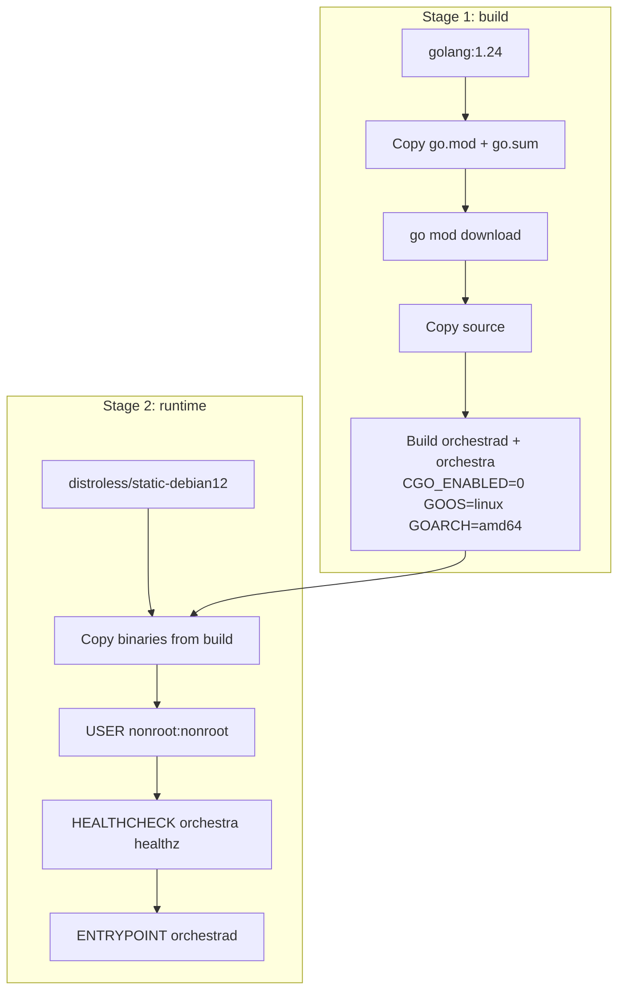
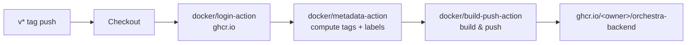

# 6.2 Container Build

> **Source files:**
> [`ops/docker/Dockerfile.backend`](../../ops/docker/Dockerfile.backend) |
> [`ops/docker/compose.yml`](../../ops/docker/compose.yml) |
> [`.github/workflows/orchestra-container-publish.yml`](../../.github/workflows/orchestra-container-publish.yml)

The Orchestra backend ships as a minimal, statically-linked container image built with a multi-stage Dockerfile and published to GitHub Container Registry (GHCR).

---

## Dockerfile Stages



### Stage 1 -- Build

| Step | Purpose |
|------|---------|
| `FROM golang:1.24 AS build` | Full Go toolchain for compilation |
| Copy `go.mod` / `go.sum` first | Layer caching -- dependency downloads are cached unless the module files change |
| `go mod download` | Pre-fetch all dependencies |
| Copy `apps/backend` source | Only invalidates the build layer when source changes |
| `go build` (x2) | Produces `/out/orchestrad` (daemon) and `/out/orchestra` (CLI) as static linux/amd64 binaries |

Build flags:

| Flag | Value | Effect |
|------|-------|--------|
| `CGO_ENABLED` | `0` | Pure Go binary, no C dependencies |
| `GOOS` | `linux` | Target operating system |
| `GOARCH` | `amd64` | Target architecture |

### Stage 2 -- Runtime

| Layer | Detail |
|-------|--------|
| Base image | `gcr.io/distroless/static-debian12` -- no shell, no package manager, minimal CVE surface |
| User | `nonroot:nonroot` -- drops all root privileges |
| Binaries | `orchestrad` and `orchestra` copied to `/usr/local/bin/` |
| Working directory | `/app` |
| Entrypoint | `/usr/local/bin/orchestrad` |

---

## Build Arguments & Environment

### Environment Variables Set in Image

| Variable | Value | Description |
|----------|-------|-------------|
| `ORCHESTRA_SERVER_HOST` | `0.0.0.0` | Bind to all interfaces inside the container |
| `ORCHESTRA_SERVER_PORT` | `4010` | Default listen port |

### Exposed Ports

| Port | Protocol | Service |
|------|----------|---------|
| `4010` | TCP | Orchestra HTTP API |

---

## Container Runtime Configuration (Compose)

The `ops/docker/compose.yml` file provides a ready-to-use local runtime:

```yaml
services:
  orchestra-backend:
    build:
      context: ../../
      dockerfile: ops/docker/Dockerfile.backend
    image: orchestra-backend:latest
    container_name: orchestra-backend
    ports:
      - "4010:4010"
    volumes:
      - orchestra-workspaces:/var/lib/orchestra/workspaces
    restart: unless-stopped
```

| Setting | Value | Purpose |
|---------|-------|---------|
| Build context | Repository root (`../../`) | Dockerfile copies from `apps/backend/` relative to repo root |
| Image name | `orchestra-backend:latest` | Local tag for composed builds |
| Volume | `orchestra-workspaces` at `/var/lib/orchestra/workspaces` | Persistent workspace storage across container restarts |
| Restart policy | `unless-stopped` | Automatic restart on failure; stops only on explicit `docker compose down` |

### Runtime Environment (Compose)

| Variable | Value |
|----------|-------|
| `ORCHESTRA_SERVER_HOST` | `0.0.0.0` |
| `ORCHESTRA_SERVER_PORT` | `4010` |
| `ORCHESTRA_WORKSPACE_ROOT` | `/var/lib/orchestra/workspaces` |

---

## Health Check

The Dockerfile includes a built-in health probe:

```dockerfile
HEALTHCHECK --interval=30s --timeout=3s --start-period=5s --retries=3 \
  CMD ["/usr/local/bin/orchestra", "healthz"]
```

The `orchestra healthz` command calls the daemon's health endpoint and returns a non-zero exit code on failure. Docker reports container status as `healthy`, `unhealthy`, or `starting` based on probe results.

---

## Image Registry (GHCR)

Container images are published by the [`orchestra-container-publish`](../../.github/workflows/orchestra-container-publish.yml) workflow.



### Tag Strategy

| Type | Pattern | Example for `v1.2.3` |
|------|---------|----------------------|
| Full semver | `{{version}}` | `1.2.3` |
| Minor semver | `{{major}}.{{minor}}` | `1.2` |
| Commit SHA | `sha-<short>` | `sha-a1b2c3d` |

This produces three tags per release, allowing consumers to pin at any granularity.

### Pulling the Image

```bash
docker pull ghcr.io/<owner>/orchestra-backend:1.2.3
docker pull ghcr.io/<owner>/orchestra-backend:1.2
docker pull ghcr.io/<owner>/orchestra-backend:sha-a1b2c3d
```

### Authentication

The workflow authenticates to GHCR using `GITHUB_TOKEN` with `packages: write` permission. No external secrets are required.

---

## Building Locally

```bash
# Build only
docker build -f ops/docker/Dockerfile.backend -t orchestra-backend:dev .

# Build and run via Compose
cd ops/docker
docker compose up --build

# Verify health
docker inspect --format='{{.State.Health.Status}}' orchestra-backend
```

---

## Cross-References

- [6. Deployment & Operations](deployment.md) -- deployment modes, environment setup, and production guidance.
- [6.1 CI/CD Pipelines](ci-cd.md) -- the `orchestra-container-publish` workflow that builds and pushes this image.
