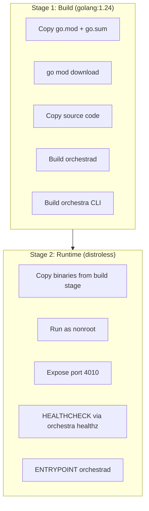

# 6.2 Container Build

> **Source files:**
> - `ops/docker/Dockerfile.backend` -- Multi-stage Dockerfile for the Orchestra backend
> - `.github/workflows/orchestra-container-publish.yml` -- CI pipeline for building and pushing

The Orchestra backend is containerized using a multi-stage Docker build that produces a minimal, distroless image containing the `orchestrad` server and `orchestra` CLI.

---

### Dockerfile Breakdown



#### Stage 1: Build

| Layer | Instruction | Purpose |
|-------|-------------|---------|
| Base | `golang:1.24` | Official Go toolchain |
| Module cache | Copy `go.mod` + `go.sum`, then `go mod download` | Separates dependency download from source compilation for layer caching |
| Compile | `CGO_ENABLED=0 GOOS=linux GOARCH=amd64 go build` | Static binary, no CGo dependencies |
| Output | Two binaries in `/out/` | `orchestrad` (server) and `orchestra` (CLI) |

#### Stage 2: Runtime

| Layer | Instruction | Purpose |
|-------|-------------|---------|
| Base | `gcr.io/distroless/static-debian12` | Minimal base image -- no shell, no package manager, no libc |
| Security | `USER nonroot:nonroot` | Runs as non-root user |
| Binaries | Copied to `/usr/local/bin/` | Both `orchestrad` and `orchestra` available |
| Config | `ORCHESTRA_SERVER_HOST=0.0.0.0` | Binds to all interfaces (required for container networking) |
| Port | `EXPOSE 4010` | Default Orchestra API port |
| Health | `HEALTHCHECK` with `orchestra healthz` | Container orchestrator health monitoring |
| Entry | `ENTRYPOINT ["/usr/local/bin/orchestrad"]` | Runs the backend server |

---

### Build Commands

#### Local Build

```bash
# From repository root
docker build -f ops/docker/Dockerfile.backend -t orchestra-backend .

# Run the container
docker run -d \
  --name orchestra \
  -p 4010:4010 \
  -e ORCHESTRA_API_TOKEN=your-secret \
  -e ORCHESTRA_WORKSPACE_ROOT=/data/workspaces \
  -v /path/to/workspaces:/data/workspaces \
  orchestra-backend
```

#### CI Build (GHCR)

The `orchestra-container-publish.yml` workflow builds and pushes to GitHub Container Registry on `v*` tags:

```bash
# Pull from GHCR
docker pull ghcr.io/<owner>/orchestra-backend:latest
```

---

### Runtime Configuration

All configuration is passed via environment variables. Key settings for containerized deployment:

| Variable | Default | Container Note |
|----------|---------|----------------|
| `ORCHESTRA_SERVER_HOST` | `0.0.0.0` | Set in Dockerfile, required for container networking |
| `ORCHESTRA_SERVER_PORT` | `4010` | Set in Dockerfile |
| `ORCHESTRA_API_TOKEN` | -- | **Required** (non-loopback host) |
| `ORCHESTRA_WORKSPACE_ROOT` | `/app` | Mount a persistent volume |

---

### Health Check Configuration

The container includes a built-in health check:

```dockerfile
HEALTHCHECK --interval=30s --timeout=3s --start-period=5s --retries=3 \
  CMD ["/usr/local/bin/orchestra", "healthz"]
```

| Parameter | Value | Description |
|-----------|-------|-------------|
| `interval` | 30s | Time between health checks |
| `timeout` | 3s | Maximum time for a health check response |
| `start-period` | 5s | Grace period for container startup |
| `retries` | 3 | Consecutive failures before marking unhealthy |

---

### Image Properties

| Property | Value |
|----------|-------|
| Base image | `gcr.io/distroless/static-debian12` |
| Architecture | `linux/amd64` |
| User | `nonroot:nonroot` |
| Shell | None (distroless) |
| Package manager | None |
| Image size | Minimal (Go static binaries + distroless base) |

---

### Security Features

1. **Distroless base**: No shell, no package manager, no unnecessary system utilities -- reduces attack surface
2. **Non-root execution**: Runs as the `nonroot` user, not `root`
3. **Static binaries**: `CGO_ENABLED=0` produces fully static binaries with no dynamic library dependencies
4. **Layer separation**: Module download is cached separately from source compilation, preventing dependency leaks in build layers

---

### Docker Compose Example

```yaml
services:
  orchestra:
    image: ghcr.io/<owner>/orchestra-backend:latest
    ports:
      - "4010:4010"
    environment:
      ORCHESTRA_API_TOKEN: "${ORCHESTRA_API_TOKEN}"
      ORCHESTRA_WORKSPACE_ROOT: /data/workspaces
      ORCHESTRA_AGENT_PROVIDER: CLAUDE
    volumes:
      - orchestra-workspaces:/data/workspaces
    healthcheck:
      test: ["/usr/local/bin/orchestra", "healthz"]
      interval: 30s
      timeout: 3s
      retries: 3

volumes:
  orchestra-workspaces:
```
