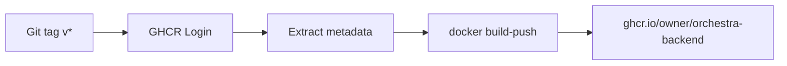

# 6.2 Container Build

> **Source files:** `ops/docker/Dockerfile.backend`, `ops/docker/compose.yml`

Orchestra's backend is containerized using a multi-stage Docker build that produces a minimal, distroless image published to GitHub Container Registry (GHCR).

## 6.2.1 Dockerfile Stages

```mermaid
flowchart LR
    subgraph Stage1["Stage 1: build (golang:1.24)"]
        COPY_MOD[Copy go.mod + go.sum]
        MOD_DL[go mod download]
        COPY_SRC[Copy backend source]
        BUILD_D[Build orchestrad]
        BUILD_C[Build orchestra CLI]
    end

    subgraph Stage2["Stage 2: runtime (distroless)"]
        BIN_D[/usr/local/bin/orchestrad]
        BIN_C[/usr/local/bin/orchestra]
        ENV[Environment defaults]
        HC[Healthcheck]
        EP[ENTRYPOINT orchestrad]
    end

    COPY_MOD --> MOD_DL --> COPY_SRC --> BUILD_D --> BUILD_C
    BUILD_D --> BIN_D
    BUILD_C --> BIN_C
    BIN_D --> EP
    BIN_C --> HC
```

### Stage 1: Build

| Step | Command | Purpose |
|------|---------|---------|
| Base image | `golang:1.24` | Go build toolchain |
| Copy module files | `COPY apps/backend/go.mod apps/backend/go.sum` | Enable dependency caching |
| Download deps | `go mod download` | Cache module downloads in a separate layer |
| Copy source | `COPY apps/backend ./apps/backend` | Copy application source |
| Build orchestrad | `CGO_ENABLED=0 GOOS=linux GOARCH=amd64 go build -o /out/orchestrad ./cmd/orchestrad` | Static daemon binary |
| Build orchestra | `CGO_ENABLED=0 GOOS=linux GOARCH=amd64 go build -o /out/orchestra ./cmd/orchestra` | Static CLI binary |

### Stage 2: Runtime

| Setting | Value | Purpose |
|---------|-------|---------|
| Base image | `gcr.io/distroless/static-debian12` | Minimal attack surface, no shell |
| User | `nonroot:nonroot` | Non-root execution for security |
| Working directory | `/app` | Application root |
| Binaries | `/usr/local/bin/orchestrad`, `/usr/local/bin/orchestra` | Copied from build stage |

## 6.2.2 Build Arguments and Configuration

### Build-time Settings

| Setting | Value | Notes |
|---------|-------|-------|
| `CGO_ENABLED` | `0` | Static binary, no C dependencies |
| `GOOS` | `linux` | Target OS |
| `GOARCH` | `amd64` | Target architecture |

### Runtime Environment

| Variable | Default | Description |
|----------|---------|-------------|
| `ORCHESTRA_SERVER_HOST` | `0.0.0.0` | Bind to all interfaces (required for container networking) |
| `ORCHESTRA_SERVER_PORT` | `4010` | HTTP API port |

### Health Check

```dockerfile
HEALTHCHECK --interval=30s --timeout=3s --start-period=5s --retries=3 \
  CMD ["/usr/local/bin/orchestra", "healthz"]
```

The container exposes a health check via the `orchestra healthz` CLI command, polled every 30 seconds with a 5-second startup grace period.

## 6.2.3 Docker Compose

The `compose.yml` provides a single-service local deployment:

```yaml
services:
  orchestra-backend:
    build:
      context: ../../
      dockerfile: ops/docker/Dockerfile.backend
    image: orchestra-backend:latest
    container_name: orchestra-backend
    environment:
      ORCHESTRA_SERVER_HOST: 0.0.0.0
      ORCHESTRA_SERVER_PORT: 4010
      ORCHESTRA_WORKSPACE_ROOT: /var/lib/orchestra/workspaces
    ports:
      - "4010:4010"
    volumes:
      - orchestra-workspaces:/var/lib/orchestra/workspaces
    restart: unless-stopped
```

| Configuration | Value | Purpose |
|---------------|-------|---------|
| Build context | `../../` (repo root) | Dockerfile references `apps/backend/` relative to repo root |
| Port mapping | `4010:4010` | Expose API on host |
| Volume | `orchestra-workspaces` | Persist agent workspace data across restarts |
| Workspace root | `/var/lib/orchestra/workspaces` | In-container workspace directory, mounted to named volume |
| Restart policy | `unless-stopped` | Auto-restart on failure, honor manual stops |

### Running with Compose

```bash
# Build and start
cd ops/docker
docker compose up -d --build

# View logs
docker compose logs -f orchestra-backend

# Stop
docker compose down
```

## 6.2.4 Registry Publishing

Container images are published to GHCR via the `orchestra-container-publish` workflow (see [Section 6.1](ci-cd.md)):



**Image coordinates:** `ghcr.io/<owner>/orchestra-backend`

**Tag strategies:**

| Pattern | Example | Use case |
|---------|---------|----------|
| Semver full | `1.2.3` | Pin to exact release |
| Semver minor | `1.2` | Track minor release line |
| SHA | `sha-abc1234` | Pin to exact commit |

### Pulling a Published Image

```bash
docker pull ghcr.io/<owner>/orchestra-backend:latest
docker run -d -p 4010:4010 ghcr.io/<owner>/orchestra-backend:latest
```

---

*Cross-references: [CI/CD Pipelines](ci-cd.md) (Section 6.1), [Configuration Guide](../guides/configuration.md) (Section 7.1), [Deployment](deployment.md) (Section 6)*
